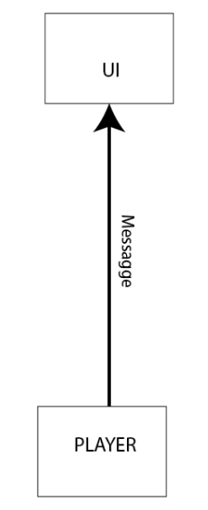
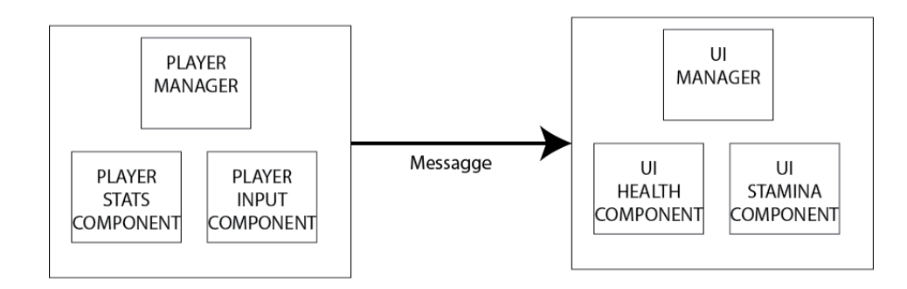
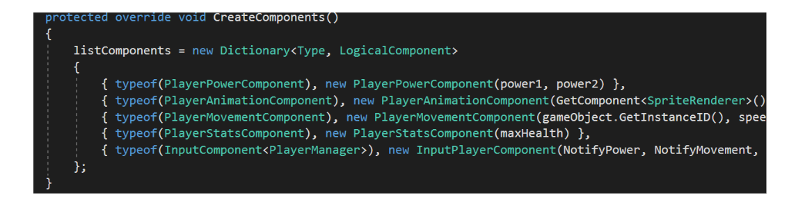
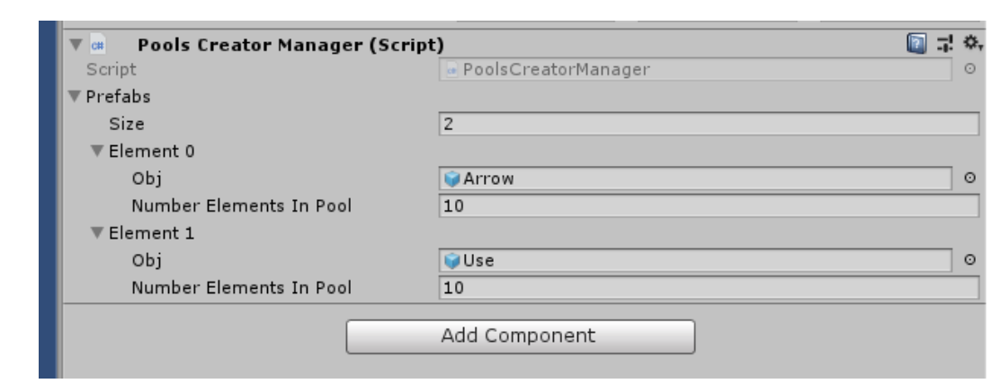

# PEARL API

## INTRODUCTION

### WHAT IS PEARL
Development in Unity for a long time and during these years I have created different classes to simplify the management and creation of games.

Pearl is the set of my knowledge: a framework that facilitates the development of Unity making the architecture of the game very modular and therefore less affected by errors.

Pearl uses the updated version of NET (4.0); therefore, lower NET version will not make the framework work.

To view a demo in Unity, view this [demo](https://github.com/AmalfiZodiaco/Pearl-Demo).
The demo was performed on the LTS version of Unity 2017.

### FEATURES
This is a list of the features of Pearl.
- Infrastructure that facilitates the granularity and modularity of the classes (see EventManager)
- Events that manage communication between classes (see EventsManager)
- Multiple tag system for GameObjects (see MultiTags)
- Automated Audio System (see Audio System)
- Pool system (see Pool System)
- Central trigger management system (see trigger System)
- Timer object and clock (see Time System)
- Input reading system integrated with the event manager (see Input System)
- Component that allows you to keep the object between scenes (see Components)
- Component that allows you to control the destruction of your gameobject (see Components)
- A debug that allows you to write also in build (see Debug System)
- Generic prefab of a gameManager (see GameManager System)
- Generic prefab of a LevelManager (see LevelManager System)
- Class system for creating a logical graph (see Graph System)
- Creation of various extensions to known classes: Dictionary, Enum, Sprite, Transform, GameObject, Math, Quaternion, Layer, etc. (see...)

### STRUCTURE
Pearl is divied in four principale folder:
- The "External" folder consists of classes that the user must modify during the creation of the game
- The "Prefabs" folder contains prefabs that the user can place directly in the game
- Resources: The folder that contains the game resources that are dynamically instantiated (accessible through the Resources.Load <T> (...) method)
- Scripts: The beating heart of Pearl, contain the classes that are used to simplify the work to the developer
  
Inside the "Scripts" folder there are folders that perform a specific function. In particular, each folder contains several classes that work together to solve a certain aspect of the game (except the Utility folder).
The classes are divided into four categories:
- Managers (see ...)
- Components (se ...)
- Static classes (static classes, have global functions and always useful)
- Utility (auxiliary classes that serve to perform complex functions on components or managers).

In the remaining document we will describe each function so you can use it for each project.

P.S: I will not list all the classes, but only the most complex ones (the others are very self-explanatory)

## EVENT SYSTEM

The scripts contained in the "Scripts / Events System" folder are the heart of Pearl and allow you to have three characteristics:
- Extreme modularity
- Communication system
- Total control of access between classes

### Extreme modularity
The concept in which Pearl is based is that there are several more or less large entities that govern a particular aspect of the game (example: The enemy entity governs all aspects of the enemy).

These entities collaborate with each other by sending messages: for example in a game there may be the entity UI and the entity Player. When the Player entity is hit, it must send a message to the UI entity to update the health bar.

In Pearl this abstraction is built thanks to these two classes:
- LogicalManager/LogicalSimpleManager
- LogicalComponent

Each entity is represented by a LogicalManager / LogicalSimpleManager (manager) and by several logicalComponents. Specifically, a manager can have zero or more components.

The logicalComponents represent particular aspects of the entity: for example the entity Player could have a component related to the management of statistics and a component related to the movement.

Entities and Managers represent the same concept. Managers are sons of MonoBehaviour, so they are components of a GameObject; instead the logicalComponents are not sons of MonoBehaviour.

### Communication system

Managers communicate with other managers through a central event manager (Events Manager) that is governed by shares.
Precisely a manager registers at the event associated with a particular action. When someone invokes the action, all the managers registered for the event associated with that action are activated.

For example, the UI entity registers its "ChangeBarHealth" method to the event associated with the "ChangeHealth" action: when the player is hurt, it will call the event associated with the "ChangeHealth" action, which will call all the methods associated with it. , including the "ChangeBarHealth" of the UI entity.

Instead the logical components of a particular manager, can not communicate with each other but can communicate only with the manager himself, through very precise interfaces.

### Total control of access between classes

Through the modular system and the communication system, entities have only three types of access:
- External (Entity-Entity): by registering a particular event in the Events Manager
- Internal (Entity-components): through the interface that the components use to communicate with their Manager.
- Singleton (Entity-Entity/Component): If the entity is a singleton, through their public methods, they are global and can be achieved by any class.

### EVENT ACTION
This enumerator (located on the "External/Events" folder) contains the actions to be associated with the events.
The user must insert a new enumerator element to generate a new action that managers can use to listen to the event associated with it.
The first four elements are by default, they should not be deleted:
- CallPause
- NewScene
- GetInputEntryMenu
- GetInputReturnUI

### EVENT MANAGER
This static class (located on the "Scripts/Event System" folder) allows the various managers to exchange messages through events related to actions. The class also manages singleton

#### GetIstance <T>
This function allows you to take the only instance of T in the scene (singleton).
  
**Output**: The only instance T in the scene

#### AddMethod
This function allows you to add a method to the event associated with a particular action.

**Input**:
- The event to associate the method: it is represented by an element of the EventAction enumerator.
- The method itself, the method can have 0, 1 or 2 input parameters.

#### RemoveMethod
This function allows you to delete a method for the event associated with a particular action.

**Input**:
- The event to associate the method: it is represented by an element of the EventAction enumerator.
- The method itself, the method can have 0, 1 or 2 input parameters.

#### CallEvent
This function allows you to call an action and then its corresponding event.
The called event will call all the methods associated with it.

**Input**:
- The event to call: it is represented by an element of the EventAction enumerator.
- The parameters to associate with the action, an action can have 0.1 or 2 parameters.

### LOGICAL SIMPLE MANAGER
This abstract class (located on the "Scripts/Event System" folder) is the simplest manager: specifically the manager without any LogicalComponent.
This manager must be the father of simple managers, specifically those without components.

#### Subscrive Events
The function allows the creation of the interface with Events Manager. In fact, the concrete child of the class, in the method, will have to subscribe all the listeners to Events Manager events.
The method is called by Unity's Awake method.

For example, in the image we see an implementation of the event.

#### Remove Events
The function allows the removal of listeners to Events Manager. In fact, the concrete child of the class, in the method, will have to remove all the listeners to Events Manager events.
The method is called by Unity's Awake method.

For example, in the image we see an implementation of the event.

#### OnAwake
A method that serves to give the user all his instructions he wants to perform in Unity's Awake method (occupied by the manager)

### LOGICAL MANAGER
This abstract class (located on the "Scripts/Event System" folder)  and represents a manager with different components.
This manager is a child of Logical Simple Manager and must be the father of managers with one or more components.

#### CreateComponents
In this abstract method, the concrete-child class must create the components. The components are created through a dictonary <Type, LogicalComponent> called listComponents: the key represents the concrete type of the component and the value the component instance (all components are children of LogicalComponent).

For example, in the image we see an implementation of the event.

#### GetLogicalComponent<T>
With this method the user is able to take a component from the manager, instead of the T one must put the class of the desired component.
  
For example, in the image we see an implementation of the event.

### LOGICAL COMPONENT
This abstract class (located on the "Scripts/Event System" folder) represents a Logical Component. The class must be the parent that all Logical Components must have.
The component class is not derived from Monobehaviour.

### MANAGER STRUCTURE
The Manager class is a very complex class, see some conventions to simplify the management work:
- Each method must be private except for two exceptions: methods called via the UI interface or if the class is a singleton.
- Divide the class into two regions: The interface region where you have to put all the methods that allow you to interface with other classes (the event manager, components, etc ...) and the logical region, where you have to put all the methods that perform some function.
- Almost all interface methods are actions, functions that return void. The only methods of interface that may not be actions are public methods called by static instance (the class must be Singleton).
- The methods of the Logic region must start with the prefix "Do-"
- In interface methods, put the SubscribEvents () and RemoveEvents () methods.
- In interface methods, put all the methods that are subscribed to the event manager. In these methods, set the prefix "Receive-". The methods, to the received message, will recall another method of the logical region that will actually respond with the appropriate function.
- In interface methods, put all the functions that generate an event, that is, the methods that send a message to the event manager: these methods have the sole purpose of calling the CallEvent method of EventsManager.
- In interface methods put the interface functions towards the components. In these methods, set the prefix "Notify-". The functions, to the received message, will call another function of the logical region that will actually respond with the appropriate function.
- The manager's children in the class name must have the suffix "Manager" (ES: PlayerManager).
- All game Monobehaviour must be either children of LogicalManager or children of SimpleLogicalManager.

### COMPONENT STRUCTURE
The Component class is a very complex class, we see some conventions to simplify the management work:
- All component methods are private except for the methods that the manager will need to activate from the outside
- Pass in the constructor the methods "Notify-" (class Action <T, F, ...>) of the manager and save them in some variables. When the component has to notify a message to the manager, it will notify him via the references saved in the variables.
- Public methods are methods that the manager accesses to order the component to do something. In these methods put the prefix "Obey-"

##MULTI TAGS
The scripts contained in the "Scripts / Multitags" folder allow the use of multiple tags in a GameObject. To enable tags, just put the MultiTags.cs component in a GameObject.

In fact, from the editor you can add tags in the component.

### TAGS
To add tags you must edit the Tags.cs script in the "external/tags" folder. This script consists of an enumerator that contains all the tags in the game. By default in the enumerator there are two tags:
- Panel
- Pool
These tags should not be deleted because they make the other toolkit scripts work.

### MULTI TAGS MANAGER
This static class (located on the "Scripts/MultiTags" folder) all functions are methods of extensions of the GameObject class (so the GameObject object will have these new methods).

#### FindGameObjectsWithMultiTags / FindGameObjectMultiTags
This static method allows you to find the gameobjects with specific tags.

**Input**
- A boolean that specifies that the gameobjects found must have ONLY those tags (if the Boolean is false, the gameobjects can also have other tags).
- The list of tags to search.

**Output**: A list of GameObjects that meet the requirements of the method.

#### HasTags
This method of extension to the GameObject allows you to see if a particular GameObject has specific tags.

**Input**: 
- The list of tags to search.

**Output**: A Boolean indicating whether the GameObject has the specified tags

#### ReturnTags
This method of extension to the GameObject allows you to have the tags of a particular GameObject.

**Output**:A list of tags that owns that GameObject.

#### AddTags
This method of extension to the GameObject allows you to add tags to the GameObject.

**Input**
- The list of tags to add.

#### RemoveTags
This method of extension to the GameObject allows you to delete tags to the GameObject.

**Input**
- The list of tags to delete.

## AUDIO SYSTEM
In the "Script / Audio System" folder there are scripts that simplify the access of the audio. To use these classes you must use a mixer already set up.

### MIXER

In the "external / Prefabs" folder, here is the mixer, that has three channels:
- Music (for music)
- Sound effects (for sound effects)
- Master (which regulates audio in general, in fact, music and sound are the master's sons).

The mixer can be expanded with other channels (for example you can add the "SoundForest" channel as a child of "SoundEffects").
It is important that each channel has exposed as a parameter its volume, which must have this nomenclature (the parameters start with the lowercase letter):

$ Channel name $ + "Volume".

For example, the volume parameter of the Master channel is named "masterVolume".

### AUDIO ENUM
This enumerator, located on "External / Audio", contains the elements that represent the mixer channels.
The nomenclature of these names must be equivalent to the $ nameChannel $ (first capital letter).
If you add a new channel to the mixer, you must add the corresponding element in the AudioEnum enumerator.

#### AUDIO MANAGER
This singleton class (located on the "Scripts/Audio System" folder). The class manages the audo.

#### GetVolume
This method allows you to have the volume of a particular mixer channel.

**Input**:
- the AudioEnum enumerator corresponding to the channel of the mixer that wants to obtain the volume.
- If the boolean is false, the volume is expressed in decibels, it is true in a number in the interval 0-1

**Output**: A float represented as a decibel or a percentage of 0-1, where 0 equals no volume and 1 equals the maximum volume (the maximum volume is defined to "rangeAudioDb" variable).

#### SetVolume
This method allows you to have the volume of a particular mixer channel.

**Input**:
- the AudioEnum enumerator corresponding to the channel of the mixer that wants to obtain the volume.
- If the boolean is false, the volume is expressed in decibels, it is true in a number in the interval [0, 1]
- A float represented as a decibel or a percentage of 0-1, where 0 equals no volume and 1 equals the maximum volume (the maximum volume is defined to "rangeAudioDb" variable).

#### SetVolume
This allows you to change the volume from a specific mixer group.

**Input**:
- the AudioEnum enumerator corresponding to the channel of the mixer that wants to obtain the volume.
- If the boolean is false, the volume is expressed in decibels, it is true in a number in the interval [0, 1]
- A float represented as a decibel or a percentage of 0-1, where 0 equals no volume and 1 equals the maximum volume (the maximum volume is defined to "rangeAudioDb" variable).
- A float representing the transition time needed to arrive at the indicated volume (The float must be greater than 0.
- An optional parameter that is a curve (AnimationCurve) that represents the change in volume over time.
The x axis represents the time: 0 represents the initial time and 1 represents the initial time plus the duration of the transition.
The y axis represents the volume: where 0 represents the initial volume and 1 the volume to be reached.
the curve must start at the point from a point (0, x) and end at a point (1, y).

## CLOCK SYSTEM
In the "Script / Utility / Clock System" folder there are utility classes that have the function of memorizing the elapsed time.

### CLOCK
This class, located on "Script / Utility / Clock System", manages a simple clock: sets up a clock that starts storing the time.

#### Clock - constructor -
**Input**:
- A Boolean indicating to theconstructor whether the clock should start off or on.

#### ResetOn
The method allows you to restart the clock.

**Input**:
- A float that lets you start the clock with already stored time.

#### Pause
The method allows you to pause the game and vice versa.

**Input**:
- A bool that represents whether the clock should pause or not.

#### ResetOff
The method allows you to turn off the clock.

#### Time
The propierty allows you to examine the elapsed time since the clock started.

**Output**: A float that represents the elapsed time since the watch was started.

### TIMER
This class, located on "Script / Utility / Clock System", is similar to the clock class, with the only exception that there is a time limit, making the clock become a timer.

#### Timer - constructor -
The manufacturer creates a timer and turns it off.

#### Timer - constructor -
**Input**:
- A float that represents the duration of the timer

#### ResetOn
The method allows you to restart the clock.

**Input**:
- A float that represents the duration of the timer.
- A float that lets you start the clock with already stored time.

#### Limit
**Output**: Returns the maximum time that the timer must last.

#### Time
The method allows you to examine the elapsed time since the timer started.

**Output**: a float between 0 and the duration of the timer that represents the elapsed time since the timer was started.

### TimeWithoutLimit
The method allows you to examine the elapsed time since the timer started.

**Output**: a float that represents the elapsed time since the timer was started (without limit).

#### TimeReversed
The method inversely examines the time elapsed since the timer started (for example, the timer duration is 5 seconds and 2 seconds have elapsed, the method will show 3 seconds).

**Output**: A float between 0 and the duration of the timer that represents the elapsed time since the timer was started.

#### IsFinish
The method allows you to see if the time stored by the timer exceeds its duration.

**Output**:A boolean that indicates if the time has expired.

#### TimeInPercent
The method allows you to examine the elapsed time as a percentage since the timer started.

**Output**:A float between 0 and 1 (timer duration) that represents the elapsed time since the timer was started.

#### TimeInPercentReversed
The method inversely examines the time spent in percentage since the timer started (for example, the timer duration is 10 seconds and 2 seconds have elapsed, the method will show 0.8).

**Output**: A float between 0 and 1 (timer duration) that represents the elapsed time since the timer was started.

## COMPONENTS
In the "Scripts / Components" folder there are all managers have a fairly common and modular function, so they can stick to any GameObject.

### DO NOT DESTROY ON LOAD MANAGER
This class, located on "Script / Components", simply serves not to destroy the object when changing scenes.
In the Inspector, there is a boolean "isUnique", this boolean if it is activated, it checks if in the scene if there is another GameObject with the same name. if it exists, the class self-destructs (useful for testing).

### DESTRUCTION ELEMENT MANAGER
This class, located on "Script / Components",  must be added to a gameobject that you want to destroy or disable.
When the gameobject is disabled or destroyed, the component sends an event to notify all its members that the object has been destroyed.
In the Inspector there is a float parameter ("timeForDestroy"); this float if activated, will destroy the GameObject after the time indicated by the parameter.

## DEBUG SYSTEM
The folder "Scripts/DebugSystem" contains scripts dedicated to debugging.

### DEBUG EXTEND
This static class, located on Scripts / Debug System" allows you to debug the game even when it is running in build.

#### Log
This static method allows you to debug your input.
If the test runs editor, the method simply activates the console. instead, if the test runs in build, the method creates an UI console (if it does not already exist) and puts its debugging on it.

**Input**:
- A generic object that is printed either in the console or in the UI console.

## INPUT SYSTEM
The "Scripts / Input System /" folder consists of classes that facilitate access to the input.
The input system, uses the events manager to communicate to all the registered objects, the input notification pressed.
The main class is the InputReaderManager class.

### INPUT READER MANAGER
The main focus of the class, located on "Script / Input System", is its Update, in it calls its component InputReaderManager that actually controls the keys pressed.

### INPUT READER COMPONENT
This script is located in the "external / input" folder and consists of reading the input.
This script must be written by the user. The script is the child of an abstract class that forces the user to implement two methods: UpdateKeyboard and UpdateJoystick.
In addition there is a variable isPause that if it is true if the game is paused (through the CallPause event), if it is false, vice versa.

#### UpdateKeyboard / UpdateJoystick
A method called by the inputManager update, is to read the input (if the joystick is active, the input manager will call UpdateJoystick if instead it is active the keyboard will call UpdateKeyboard) ..
If an exact input is active, call the eventsManager with the specific action (using the static CallEvent method).

You see the image for an example:

### POOL SYSTEM
In the "Script / Pool System" folder there are classes that implement a pooling service.

To create the pool, you must put the "PoolsCreator" prefab ("External/Prefabs")in the scene. The object consists of a list of prefabs which, when the scene is initialized, will be created and instantiated in pools.
Each prefab is associated with an integer indicating how many pieces must be created for each prefab.
In the image there is an example where the pools creator Manager instantiates 10 gameobjec "Use" and 10 gameobject "Arrow".

To instantiate a prefab of the pool you must use the static method:

*GameObjectExtend.InstantiatePool*

Instead to disable the prefab of the pool you must use the static method

*GameObjectExtend.Destroy*

It is important that the prefab that is used to instantiate the pool is the same that will be used in the "GameObjectExtend.InstantiatePool" and "GameObjectExtend.Destroy" methods.

## GAME MANAGER SYSTEM
In the "Scripts / Game manager System" folder, you will find the scripts that are related to the GameManager concept.
The GameManager is a class that contains general data and methods that are valid for each scene in the game.
On the "Prefab" folder there is the prefab GameManager which must be placed in the first scene of the game.

### SCENE ENUM
The script located on the "External / Scene" folder is an enumerator where each element is the name of a unity scene.
Each element must have the same name as the corresponding Unity scene.
By default there is the Null element, which must not be removed (the element is used for scenes not recorded in the enumerator).

### GAME MANAGER
The singleton class, found in the "Scripts / Game Manager System", has several variables in the inspector:
- The version number of the game.
- An element of SceneEnum that consists of the current scene.
- A boolean representing the game is in debug mode (if it is true, it activates the frame count).
If you want to create a custom GameManager, it must be a child of the GameManager (/ The naming convention is $ Game Title $ + "Manager"),
Remember to replace the custom GameManager in the GameManager prefab.

### NewLevel
This method allows you to change scene.

**Input**:
- An element of SceneEnum that consists of the scene in which we want to arrive.

### EnableMouse
This method allows you to enable or disable the mouse.

**Input**:
- A Boolean indicating that the mouse must be enabled or disabled.

### LEVEL MANAGER SYSTEM
In the "Scripts/Level Manager System" folder are the classes that are related to the LevelManager concept.
The LevelManager is a class that contains general data and methods useful for a generic level.
In the "external/Prefab" folder there is the LevelManager prefab that must be placed in every game scene.

#### LEVEL MANAGER
This singleton class, found in "Scripts / level Manager System" has several variables in the inspector:
- The prefabs of the Pools Creator (see pools system)
If you want to create a custom LevelManager for each level you must create a new child element of the LevelManager (The naming convention is $ Level Title $ + "Manager").

Remember to replace the custom LevelManager in the LevelManager prefab instance.
The class has two functions:
- Instantize, if it exists, the pools Creator (if you use the level manager, remember not to put the pools creator on the scene).
- Activate its PauseComponent component when the CallPause event is called. In this component, when the game is paused it will activate the Time.timeScale = 0 or Time.timeScale = 1 when the game is no longer paused.

## EXTEND UI
The "Scripts / Extend UI" folder contains scripts that let you create UI easier.
The abstraction that uses Pearl to create the menus is that a UI is made up of panels and there is always only one panel open while all the others are closed.
If you want to create a UI using Pearl, you must follow these rules.
- The direct children of the canvas are a list of all the panels.
- The root of each panel must have the Multitags component and have the Panel tag in it.
- The children of the panel are the elements that appear only inside the parent panel.
- Convention: Panels must end with "Panel" suffix.
In the image below, an example of a minimal UI.

### MENU MANAGERS
The abstract class, which is located in the "Script / UI Extend" folder, must be the parent of all UIs that are created through the Pearl system.
This class has two variables in the inspector:
- The first variable indicates the first GameObject that will be selected in the UI.
- The second indicates whether the UI is an initial UI (menu) or in game (pause).

This default class is subscribed to two events:
- *GetInputEntryMenu*: returns to the previous action by pressing the / i key associated with the event.
- *GetInputReturnUI*: allows you to open / close the menu by pressing the key associated to the event / s, it works only when the UI is in status pause.

In the game, if you call the menu, the class will call the CallPause event (putting the game on pause).

#### ChangeButton
This public method of UI (which can be activated, then via buttons, etc.), allows you to change the selected / active object. If the button is in another panel, the reference panel will also change.

**Input**:
- The reference to the gameobject that you want to select / activate.

#### Quit
This method allows you to close the game.

#### New Game
This method allows you to start a new game using the GameManager.
**Input**:
- the ScenEnum element representing the initial scene

## TRIGGER SYSTEM
Premise: this element has been tested little and certainly will be corrected and improved in future editions.
The scripts in the "Scripts / Trigger System" folder take care of creating Trigger between objects in a cleaner way.

The focus is to have Trigger Manager (a trigger handler) in every gameobject. The trigger manager manages all triggers (triggered gameobjects) and routes trigger information to events that need it.

The trigger could have information to give to the Trigger Manager, for this it must possess the ComplexAction component that has a string-object dictionary. When the trigger manager is activated (when the trigger hits the trigger manager), it will take the information from the trigger dictionary and send it to the various methods that await the trigger.

### Trigger Manager
The main class of the Trigger System is found in the "Scripts / Trigger System".
The class, as mentioned before, waits for any type of trigger and then to notify or send the information (if any) to the various methods that are registered.

The trigger manager has two variables in the inspector:
- The first variable is a list of gameobjects, these gameobjects are the listeners of the trigger manager. When activating the trigger manager, the class notifies (and sends information) to all listeners, in particular to the components of the listeners who implement the ITrigger interface method.
- The second variable is a list of tags, if the trigger (the gameobject) does not own those tags it will be ignored and the trigger manager will not be activated.

### ITrigger
This interface must be implemented for all classes waiting for a call from the trigger manager.

#### Trigger
The method is activated when called by the trigger manager.

***Input**:
- the first parameter is an instance of Informations, Informations is a class that only contains the string-object dictionary of the complex action class.
- The second parameter is the list of the tags of the trigger (useful if you want to make a double check specific to each method).
In this example there is a implementation fo Trigger Method:

## FRAME RATE
The "Script / framerate /" folder contains scripts that allow to calculate the frame rate of the game.
The *FrameRateManager* script calculates the frameRate at the logical level, has a public property that shows the last frame rate calculated.

Instead, the *FrameRateDebugManager* script shows the framerate in a text component of the UI.
On the prefabs directory there is a prefab called frameRateUI which consists of an UI with the two collaborating scripts: just put the UI on the scene and the frameRate will be shown in the upper left corner.

## GRAPH SYSTEM
The folder "Script / Utily / graph" folder contains scripts that have the function of creating a logical graph with nodes and arcs.

GRAPH <T>
In this class, in the "Script / Utily / graph" folder, the graph can be direct or not directed.
The generic parameter *T* must be substituted for the actual content of the vertex.
The class consists of a set of vertices.

### [T index]
The index method of the graph: by placing the instance of the graph and in brackets the content of a vertex, it will be accessed, if it exists, the vertex of the graph that owns that content.

### AddVertex
This method adds, if not already existed, a vertex of the graph.

**Input**:
- The generic instance T that represents the contents of the vertex.

### RemoveVertex
This method removes a specific vertex of the graph.

**Input**:
- The generic instance T that represents the contents of the vertex.

### AddArch
This method adds an arc between two vertices of the graph (vertex 1 and vertex 2)

**Input**:
- The generic instance T that represents the content of vertex 1.
- The generic instance T that represents the content of vertex 2.
- An integer representing the weight of the bow.

### RemoveArch
This method removes an arc between two vertices of the graph (vertex 1 and vertex 2)

**Input**:
- The generic instance T that represents the content of vertex 1.
- The generic instance T that represents the content of vertex 2.

### HasVertex
This method checks if the graph vertex exists

**Input**:
- The generic instance T that represents the content of the vertex to be checked if it exists in the graph.

### HasArch
This method controls whether there is an arc that connects two specific vertices of the graph (vertex 1 and vertex 2).

**Input**:
- The generic instance T that represents the content of vertex 1.
- The generic instance T that represents the content of vertex 2.
